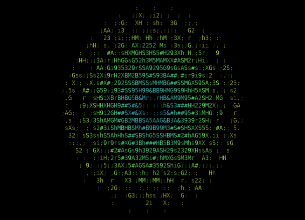

# mandalac

[](https://github.com/nekrasovp/mandalac/actions/workflows/build.yml)
[](LICENSE)

A live, full-screen ASCII mandala generated from the **240 roots of the E8
lattice**. The geometry is computed in real time, continuously rotated in
eight dimensions, projected through the Coxeter plane, and density-rendered
directly in an ANSI terminal.



There are no embedded frames and no runtime dependencies beyond the C math
library. Every point in the animation is derived from the E8 root system.

E8 is the unique positive-definite even unimodular lattice in eight
dimensions, up to isometry. Its 240 shortest non-zero vectors have squared
length 2; their convex hull is the $4_{21}$ Gosset polytope. `mandalac` turns
that exceptional finite geometry into a continuously evolving terminal image
without replacing it with noise or a procedural approximation.

## Build and run

Requirements: a C11 compiler, `make`, a Unix-like OS, and an ANSI terminal
with 24-bit color support.

```sh
make
./mandala
```

Press `Ctrl+C` to stop. The alternate screen, cursor, and colors are restored
on normal exit and on `SIGINT`, `SIGTERM`, or `SIGHUP`. The picture adapts to
terminal resizing without changing the physical aspect ratio of the mandala.

Useful options:

```text
-f, --fps N       frame rate, 1..120 (default: 30)
-c, --cycle SEC   seamless cycle duration, 2..300 (default: 24)
    --frames N    stop after N frames
    --no-color    monochrome ASCII output
    --no-rays     hide the faint radial traces
    --check       validate the E8 geometry and exit
```

For a calmer monochrome view:

```sh
./mandala --no-color --no-rays --cycle 40
```

## From E8 to a terminal frame

```text
240 E8 roots
     |
     v
12 periodic Givens rotations in R^8
     |
     v
Coxeter-plane projection R^8 -> R^2
     |
     v
aspect correction + adaptive scale
     |
     v
bilinear density splatting + radial traces
     |
     v
ASCII ramp + radius/phase color -> one buffered terminal write
```

### 1. The 240 roots

The program constructs the E8 root system at startup as the disjoint union

$$
\Phi_{E_8} =
\left\{(\pm1,\pm1,0,\ldots,0)\right\}
\;\cup\;
\left\{\frac12(\pm1,\ldots,\pm1)\;\middle|\;
\text{an even number of minus signs}\right\}.
$$

The first family contains
$\binom{8}{2} \cdot 2^2 = 112$ roots. The parity constraint leaves
$2^7 = 128$ half-integer roots. All 240 vectors have squared norm 2.

No coordinates are loaded from an asset or generated offline. `--check`
verifies the count, norms, uniqueness, and invariance under the Coxeter map.

### 2. Reflections and the Coxeter plane

For a root $\alpha$ with $\langle\alpha,\alpha\rangle=2$, its Weyl reflection
is

$$
s_\alpha(x) = x -
2\frac{\langle x,\alpha\rangle}{\langle\alpha,\alpha\rangle}\alpha
= x - \langle x,\alpha\rangle\alpha.
$$

The product of the eight simple-root reflections gives a Coxeter
transformation $C$. For E8 its Coxeter number is $h=30$, so $C^{30}=I$.
Consequently, the 240 roots split into **eight 30-element Coxeter orbits**.

Instead of storing a precomputed projection matrix, `mandalac` extracts the
real exponent-1 eigenspace of $C$ with a discrete Fourier projection. Starting
from a simple root $a$, it computes

$$
u = \sum_{k=0}^{29}\cos\left(\frac{2\pi k}{30}\right)C^k a,
\qquad
v = \sum_{k=0}^{29}\sin\left(\frac{2\pi k}{30}\right)C^k a.
$$

The vectors are normalized and orthogonalized to form the Coxeter-plane basis.
The static projection of each root $r$ is then

$$
p(r) = \left(\langle r,u\rangle,\langle r,v\rangle\right).
$$

This is the projection responsible for the concentric rings and 30-fold
structure visible whenever the animation returns to its coherent phase.

### 3. Seamless motion in eight dimensions

Each frame applies twelve Givens rotations in different coordinate planes.
For animation phase $\varphi\in[0,2\pi)$, rotation $m$ uses

$$
\theta_m(\varphi) =
A_m\frac{1-\cos\varphi}{2}
\sin(n_m\varphi+\delta_m).
$$

The envelope $(1-\cos\varphi)/2$ is zero, with zero derivative, at both ends
of the cycle. Therefore the complete 8D transform starts and ends at the
identity without a positional or velocity discontinuity. Different integer
harmonics $n_m$, amplitudes $A_m$, and phases $\delta_m$ make the roots move
from exact Coxeter symmetry through a complex cloud and back again.

A separate periodic in-plane rotation and breathing factor keep the image
alive without changing the underlying E8 vectors.

### 4. Density-based ASCII rendering

Projected points rarely land exactly on terminal cells. Each point is
therefore distributed over its four neighbours with bilinear weights and a
small halo. Optional center-to-root traces reinforce the radial structure.
Contributions accumulate into an energy value $E$ per cell.

The nonlinear transfer function

$$
d(E)=1-e^{-1.35E}
$$

compresses high-density intersections without losing isolated roots. The
result selects a character from

```text
 .,:;irsXA253hMHGS#9B&@
```

Color is derived from normalized radius and animation phase. Terminal cells
are assumed to be roughly twice as tall as they are wide, so the horizontal
projection radius is doubled relative to the vertical radius. The scale is
recomputed for every frame to keep extreme deformations inside the viewport.

### 5. Rendering architecture

- **Fixed mathematical state:** 240 roots, 8-dimensional vectors, 12 rotation
  planes. No per-frame heap allocation.
- **Dynamic screen state:** one density buffer and one terminal-output buffer,
  both reallocated only after terminal resize.
- **Low-flicker output:** a complete frame is composed in memory and emitted
  with one `fwrite`, using cursor-home instead of clearing between frames.
- **Stable pacing:** `CLOCK_MONOTONIC` deadlines prevent accumulated sleep
  drift; late frames are skipped instead of building a backlog.
- **Bounded memory:** terminal buffers are capped at 2,000,000 cells and all
  dimension products are checked before allocation.

For a terminal of $W\times H$ cells, 240 roots, 12 rotation planes, and mean
ray length $L$, the cost of one frame is

$$
O(W H + 240(12 + L)),
$$

with $O(W H)$ memory. At ordinary terminal sizes, clearing and serializing the
screen buffer dominate the 8D mathematics.

## Validation and preview generation

Run the deterministic geometry checks with:

```sh
make check
```

The check covers all root invariants, Coxeter-plane orthonormality,
$C^{30}=I$, and the eight disjoint 30-root orbits. GitHub Actions builds and
checks the program with both GCC and Clang.

The README animation is optional and requires Python 3 and Pillow:

```sh
make preview
```

The capture tool runs the real executable in a pseudo-terminal and interprets
the ANSI stream. The generated GIF is documentation only; it is never used by
`mandala`.

## License

[MIT](LICENSE) © 2026 pinekrasov
